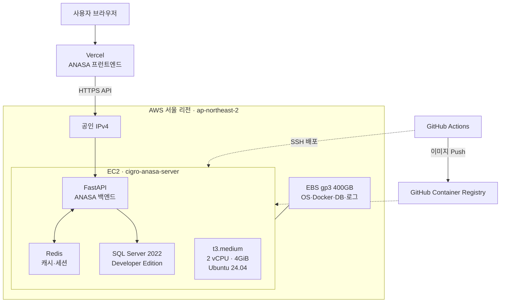

# ANASA 서버·DB·SQL Server 통합 예상 견적

| 항목 | 내용 |
| --- | --- |
| 작성일 | 2026-08-28 |
| 기준 리전 | AWS 서울 `ap-northeast-2` |
| 환율 | USD 1달러 = 1,400원 |
| 비용 표기 | 달러·원화 모두 VAT 10% 포함 |
| 견적 기준 | 온디맨드 인프라, SQL Server 2022 Standard 4코어 |
| 권장안 | SQL Server Standard 영구 4코어 + 앱 `t3.large` + 현재 DB의 3배 |

## 1. 요약

현재 ANASA 스테이징은 단일 EC2에서 애플리케이션, Redis, SQL Server Developer Edition을 함께 운영한다. 실제 운영 전에는 Developer Edition을 사용할 수 없으므로 SQL Server Standard Edition으로 전환한다.

현재 DB는 총 약 278.72GB이며, 현재 DB의 3배인 약 836GB를 대표 예산 기준으로 삼았다. 3배는 확정된 요구사항이 아니라 중간 성장 시나리오이며, 현재 DB (1배)·현재 DB의 2배·현재 DB의 3배·현재 DB의 5배 시나리오를 함께 비교한다. 운영 안정성을 위해 앱 서버와 DB 서버를 분리하고 DB 저장공간은 1.1TB로 산정했다.

개별 인프라 가격은 7장, SQL Server 라이선스 가격은 8장, 모든 항목을 합산한 최종 통합 견적은 9장에 정리했다.

고객사가 최소 3년 이상 운영하고 앱 서버를 `t3.large`로 전환할 가능성이 높으므로 **SQL Server Standard 영구 라이선스 + `t3.large`**를 권장안으로 둔다. 현재 DB의 3배 기준으로 첫해는 영구 라이선스 일시구매를 포함해 약 **2,006만원**, 2년 차부터는 월 약 **66만원 / 연 약 791만원**이다. 연간 구독과 `t3.medium`은 비교안으로 계속 유지한다.

### 비용 표기 규칙

- 인프라·통합 반복비용 표는 `월 비용(VAT 포함)`과 `연 비용(VAT 포함)`을 함께 표시한다.
- SQL Server 라이선스 자체 표는 연간 구독의 연 비용과 영구 라이선스의 일시 비용을 표시하고, 월 환산은 통합표에서만 사용한다.
- 영구 라이선스는 첫해에만 일시 구매 비용이 포함되므로, 첫해 총액과 2년 차 이후 반복비용을 구분한다.
- 실제 청구액은 환율, 세금 처리, CSP 할인, 사용량에 따라 달라질 수 있다.

## 2. 현재 인프라 구조



현재 구조는 앱과 DB가 단일 서버에 함께 있어 운영 부하와 장애가 한 서버에 집중된다. 아래 견적은 운영 환경에서 앱 서버와 DB 서버를 분리하는 것을 전제로 한다.

## 3. 현재 DB 용량

| DB | 데이터 | 로그 | 합계 |
| --- | ---: | ---: | ---: |
| MISTO | 136.33GB | 0.49GB | 136.82GB |
| MISPD | 107.43GB | 8.61GB | 116.04GB |
| MISTW | 13.13GB | 1.70GB | 14.83GB |
| MISSA | 3.29GB | 4.42GB | 7.71GB |
| MISCM | 3.23GB | 0.09GB | 3.32GB |
| **합계** | **263.41GB** | **15.31GB** | **278.72GB** |

`BIZCLIENT`는 조회 계정의 접근 권한이 없어 용량과 기능 검사 범위에서 제외되었다.

## 4. SQL Server Standard 선정 근거

- Developer Edition은 개발·테스트 전용이므로 실제 운영에 사용할 수 없다.
- Express Edition은 DB당 데이터 10GB 제한이 있어 MISTO, MISPD, MISTW를 수용할 수 없다.
- 접근 가능한 5개 DB의 `sys.dm_db_persisted_sku_features` 검사 결과는 0건이다.
- HADR 및 클러스터 구성이 확인되지 않았다.
- Standard Edition은 현재 DB 용량과 현재 DB의 3–5배 성장 시나리오를 수용할 수 있다.
- Standard의 최대 24코어 및 128GB 버퍼 풀 한도는 견적 기준인 4 vCPU·32GB보다 충분히 높다.
- 현재 확인 범위에서는 Enterprise Edition의 추가 비용을 정당화할 전용 기능 요구가 없다.

`BIZCLIENT`가 운영 범위에 포함된다면 접근 권한 확보 후 같은 기능 검사를 수행해야 최종 확정할 수 있다.

## 5. SQL Server 2022 에디션 비교 요약

| 에디션 | 운영 사용 | DB 엔진 한도 | 버퍼 풀 | 최대 DB 크기 | ANASA 판단 |
| --- | :---: | ---: | ---: | ---: | --- |
| Enterprise | 가능 | 운영체제 최대 | 운영체제 최대 | 524PB | 전용 기능이 필요할 때만 검토 |
| Standard | 가능 | 4소켓 또는 24코어 | 128GB | 524PB | **현재 권장안** |
| Web | 제한적 | 4소켓 또는 16코어 | 64GB | 524PB | 웹 호스팅 사업자용으로 부적합 |
| Developer | 불가 | Enterprise와 동일 | Enterprise와 동일 | 524PB | 스테이징 전용 |
| Evaluation | 불가 | Enterprise와 동일 | Enterprise와 동일 | 524PB | 180일 평가용 |
| Express | 가능 | 1소켓 또는 4코어 | 1,410MB | DB당 10GB | 현재 DB 용량으로 사용 불가 |

에디션별 용도, 성능·용량 한도, 고가용성 기능 및 가격은 별도 문서에서 확인한다.

- [SQL Server 2022 전체 에디션 비교](./sql-server-2022-edition-comparison.md)
- [Microsoft 공식 SQL Server 2022 기능 비교](https://learn.microsoft.com/en-us/sql/sql-server/editions-and-components-of-sql-server-2022?view=sql-server-ver16)
- [Microsoft 공식 SQL Server 2022 가격](https://www.microsoft.com/en-us/sql-server/sql-server-2022-pricing)

## 6. 운영 견적 구성

| 구분 | 견적 사양 |
| --- | --- |
| 앱 서버 | 운영 기준 EC2 `t3.large` 2 vCPU·8GiB, 현재는 `t3.medium` |
| 앱 저장공간 | gp3 50GB |
| DB 서버 | EC2 `r7i.xlarge`, 4 vCPU·32GiB |
| DB 저장공간 | 데이터 증가 시나리오별 gp3 EBS |
| DBMS | SQL Server 2022 Standard 4코어 |
| 네트워크 | 공인 IPv4 1개 및 현재 수준의 외부 전송량 |

## 7. 개별 인프라 가격

아래 표는 라이선스 비용과 통합하지 않은 개별 비용이다. 모든 금액은 `VAT 포함`, 달러는 USD 1달러 = 1,400원 환산 기준이다.

### 7.1 앱 서버

운영 앱 서버는 `t3.large` 전환 가능성이 높아 권장 견적에 반영했다. `t3.large`는 현재 `t3.medium`과 vCPU는 2개로 동일하고 메모리만 4GiB에서 8GiB로 증가한다.

| 항목 | `t3.medium` | `t3.large` |
| --- | ---: | ---: |
| vCPU | 2 | 2 |
| 메모리 | 4GiB | 8GiB |
| 서울 Linux 온디맨드 단가(세전) | $0.052/시간 | $0.104/시간 |
| 월 비용(VAT 포함) | **$42.56 / 약 6만원** | **$85.11 / 약 12만원** |
| 연 비용(VAT 포함) | **$510.68 / 약 72만원** | **$1,021.36 / 약 143만원** |

`t3.large` 변경 시 앱 서버 비용은 월 **$42.56(약 6만원)**, 연 **$510.68(약 72만원)** 증가한다. 메모리 부족에는 도움이 되지만 CPU 병목은 해결하지 않는다.

### 7.2 앱 서버 부대 비용

| 항목 | 산정 기준 | 월 비용(VAT 포함) | 연 비용(VAT 포함) |
| --- | --- | ---: | ---: |
| 앱 EBS gp3 | 50GB | **$5.02 / 약 0.7만원** | **$60.19 / 약 8.4만원** |
| 공인 IPv4 | 1개 | **$4.09 / 약 0.6만원** | **$49.10 / 약 6.9만원** |
| 네트워크 전송 | 현재 사용량 기준 상한 | **$5.17 / 약 0.7만원** | **$62.09 / 약 8.7만원** |
| 앱 부대 비용 합계 | EBS + IPv4 + 네트워크 | **$14.28 / 약 2.0만원** | **$171.38 / 약 24.0만원** |

네트워크 금액은 계정 공용 무료 전송량에 따라 실제 청구액이 낮아질 수 있는 상한 추정치다.

### 7.3 DB 서버

| 항목 | 사양 | 월 비용(VAT 포함) | 연 비용(VAT 포함) |
| --- | --- | ---: | ---: |
| DB 서버 EC2 | `r7i.xlarge`, 4 vCPU·32GiB | **$261.23 / 약 36.6만원** | **$3,134.80 / 약 438.9만원** |

### 7.4 DB EBS 저장공간

DB 저장공간은 다음 방식으로 계산했다.

```text
권장 저장공간 = 예상 DB 용량 × 1.25 + 시스템 공간 약 50GB
```

25%는 데이터 증가, 트랜잭션 로그, 임시 작업을 위한 여유이며 결과는 실제 구성 단위로 올림했다.

서울 리전 gp3 저장공간에는 ANASA 계정의 2026-08 Cost Explorer 실측 단가인 **$0.0912/GB-월**을 적용했다. gp3는 3,000 IOPS와 125MB/s 처리량을 기본 포함하며 초과 설정, 스냅샷과 장기 백업은 별도 과금이다.

| EBS 용량 | 월 비용(VAT 포함) | 연 비용(VAT 포함) | 적용 시나리오 |
| ---: | ---: | ---: | --- |
| 400GB | $40.13 / 약 5.6만원 | $481.54 / 약 67.4만원 | 현재 볼륨 |
| 500GB | $50.16 / 약 7.0만원 | $601.92 / 약 84.3만원 | 현재 DB 권장 |
| 750GB | $75.24 / 약 10.5만원 | $902.88 / 약 126.4만원 | 현재 DB의 2배 |
| 1.1TB | $110.35 / 약 15.4만원 | $1,324.22 / 약 185.4만원 | 현재 DB의 3배 |
| 1.8TB | $180.58 / 약 25.3만원 | $2,166.96 / 약 303.4만원 | 현재 DB의 5배 |

- [EBS gp3 가격 산정 상세](./aws-ebs-gp3-pricing.md)
- [AWS 공식 EBS 가격](https://aws.amazon.com/ebs/pricing/)
- [AWS 공식 gp3 성능·기본 제공량](https://docs.aws.amazon.com/ebs/latest/userguide/general-purpose.html#gp3-ebs-volume-type)

## 8. SQL Server 라이선스 가격

라이선스 자체의 가격만 별도로 표시한다. 인프라와 합산한 최종 금액은 다음 통합 견적 표에서 계산한다.

| 라이선스 방식 | 라이선스 비용(세전) | VAT 포함 비용 | 과금 성격 | 판단 |
| --- | ---: | ---: | --- | --- |
| Standard 영구 4코어 | $7,890 | **$8,679 / 약 1,215만원** | 첫해 일시 구매 | **3년 이상 운영 권장안** |
| Standard 연간 구독 4코어 | $2,836/년 | **$3,119.60/년 / 약 436.7만원** | 매년 반복 | 초기비용 최소화 대안 |

영구 라이선스는 첫해에만 일시 구매 비용이 발생한다. 연간 구독의 월 비용은 최종 통합표 계산에서만 연간 금액을 12개월로 환산한다. 실제 구매가는 CSP 할인, Software Assurance, License Mobility 조건에 따라 달라진다. 특히 영구 라이선스를 AWS EC2에 적용할 수 있는지는 Microsoft CSP의 사전 확인을 받아야 한다.

## 9. 통합 예상 비용 — DB 성장별

아래 표가 앱 서버, DB 서버, EBS, 네트워크 및 SQL Server 라이선스를 모두 합산한 최종 견적이다. 모든 금액은 VAT 포함이다.

### 9.1 Standard 영구 라이선스 — `t3.medium` (비교안)

SQL Server Standard 4코어 영구 라이선스 공개 정가는 7,890달러다. 첫해에 라이선스를 일시 구매하고, 이후에는 동일 버전을 계속 사용하며 추가 유지계약이 없다는 가정이다.

| DB 증가 | 예상 DB | 권장 디스크 | 첫해 총액(VAT 포함) | 첫해 월 환산(참고) | 2년 차 이후 월 비용(VAT 포함) | 2년 차 이후 연 비용(VAT 포함) |
| --- | ---: | ---: | ---: | ---: | ---: | ---: |
| 현재 DB (1배) | 279GB | 500GB | **$13,098 / 약 1,834만원** | **$1,092 / 약 153만원** | **$368 / 약 52만원** | **$4,419 / 약 619만원** |
| 현재 DB의 2배 | 557GB | 750GB | **$13,399 / 약 1,876만원** | **$1,117 / 약 156만원** | **$393 / 약 55만원** | **$4,720 / 약 661만원** |
| 현재 DB의 3배 | 836GB | 1.1TB | **$13,820 / 약 1,935만원** | **$1,152 / 약 161만원** | **$428 / 약 60만원** | **$5,141 / 약 720만원** |
| 현재 DB의 5배 | 1.39TB | 1.8TB | **$14,663 / 약 2,053만원** | **$1,222 / 약 171만원** | **$499 / 약 70만원** | **$5,984 / 약 838만원** |

### 9.2 Standard 영구 라이선스 — `t3.large` (권장)

| DB 증가 | 예상 DB | 권장 디스크 | 첫해 총액(VAT 포함) | 첫해 월 환산(참고) | 2년 차 이후 월 비용(VAT 포함) | 2년 차 이후 연 비용(VAT 포함) |
| --- | ---: | ---: | ---: | ---: | ---: | ---: |
| 현재 DB (1배) | 279GB | 500GB | **$13,608 / 약 1,905만원** | **$1,134 / 약 159만원** | **$411 / 약 58만원** | **$4,929 / 약 690만원** |
| 현재 DB의 2배 | 557GB | 750GB | **$13,909 / 약 1,947만원** | **$1,159 / 약 162만원** | **$435 / 약 61만원** | **$5,230 / 약 732만원** |
| 현재 DB의 3배 | 836GB | 1.1TB | **$14,331 / 약 2,006만원** | **$1,194 / 약 167만원** | **$471 / 약 66만원** | **$5,652 / 약 791만원** |
| 현재 DB의 5배 | 1.39TB | 1.8TB | **$15,173 / 약 2,124만원** | **$1,264 / 약 177만원** | **$541 / 약 76만원** | **$6,494 / 약 909만원** |

### 9.3 Standard 연간 구독 — `t3.medium` (비교안)

SQL Server Standard 4코어 구독료는 공개 정가 기준 연 2,836달러다. 월 비용은 연간 구독료를 12개월로 환산한 값이며 실제 결제 조건은 판매 계약에 따른다.

| DB 증가 | 예상 DB | 권장 디스크 | 월 비용(VAT 포함) | 연 비용(VAT 포함) |
| --- | ---: | ---: | ---: | ---: |
| 현재 DB (1배) | 279GB | 500GB | **$628 / 약 88만원** | **$7,538 / 약 1,055만원** |
| 현재 DB의 2배 | 557GB | 750GB | **$653 / 약 91만원** | **$7,839 / 약 1,098만원** |
| 현재 DB의 3배 | 836GB | 1.1TB | **$688 / 약 96만원** | **$8,261 / 약 1,156만원** |
| 현재 DB의 5배 | 1.39TB | 1.8TB | **$759 / 약 106만원** | **$9,103 / 약 1,275만원** |

### 9.4 Standard 연간 구독 — `t3.large` (비교안)

| DB 증가 | 예상 DB | 권장 디스크 | 월 비용(VAT 포함) | 연 비용(VAT 포함) |
| --- | ---: | ---: | ---: | ---: |
| 현재 DB (1배) | 279GB | 500GB | **$671 / 약 94만원** | **$8,049 / 약 1,127만원** |
| 현재 DB의 2배 | 557GB | 750GB | **$696 / 약 97만원** | **$8,350 / 약 1,169만원** |
| 현재 DB의 3배 | 836GB | 1.1TB | **$731 / 약 102만원** | **$8,771 / 약 1,228만원** |
| 현재 DB의 5배 | 1.39TB | 1.8TB | **$801 / 약 112만원** | **$9,614 / 약 1,346만원** |

### 9.5 최종 통합 견적표 — 현재 DB의 3배 기준

| 선택지 | 월 비용(VAT 포함) | 첫해 연 비용(VAT 포함) | 2년 차 이후 연 비용(VAT 포함) |
| --- | ---: | ---: | ---: |
| **권장: Standard 영구 구매 + `t3.large`** | 첫해 환산 **$1,194 / 약 167만원** | **$14,331 / 약 2,006만원** | **$5,652 / 약 791만원** |
| 비교: Standard 영구 구매 + `t3.medium` | 첫해 환산 **$1,152 / 약 161만원** | **$13,820 / 약 1,935만원** | **$5,141 / 약 720만원** |
| 비교: Standard 연간 구독 + `t3.medium` | **$688 / 약 96만원** | **$8,261 / 약 1,156만원** | **$8,261 / 약 1,156만원** |
| 비교: Standard 연간 구독 + `t3.large` | **$731 / 약 102만원** | **$8,771 / 약 1,228만원** | **$8,771 / 약 1,228만원** |

DB 성장 시나리오별 상세 합계는 9.1–9.4 표를 따른다. `t3.large`로 변경하면 DB 증가 배수와 관계없이 월 약 **$43**, 연 약 **$511**이 추가된다.

최소 3년 이상 운영할 예정이므로 영구 라이선스를 권장한다. 영구 라이선스의 AWS EC2 적용에는 Software Assurance 및 License Mobility 조건 확인이 필요하므로 Microsoft CSP의 최종 검토를 받아야 한다.

## 10. 계산 논리

- 앱 서버, DB 서버 및 SQL Server 라이선스는 사양을 유지하는 동안 고정비다.
- DB 데이터 증가에 따라 직접 증가하는 비용은 주로 EBS 저장공간이다.
- SQL Server 코어 라이선스는 DB 용량이 아니라 할당된 CPU 코어 수를 기준으로 한다.
- 데이터가 증가해도 4 vCPU·32GB를 유지하면 라이선스 비용은 동일하다.
- CPU·메모리 부족으로 DB 서버를 증설하면 EC2와 SQL Server 코어 라이선스 비용이 함께 증가할 수 있다.

## 11. 사용자 수·요청량에 따른 비용 변동

현재 구성에서는 사용자 수나 API 요청 수에 비례해 요청당 요금이 붙지 않는다. EC2에서 실행되는 FastAPI·Redis·MSSQL은 기본적으로 서버가 켜져 있는 시간과 할당된 저장공간 기준으로 과금된다.

| 증가 요인 | 현재 구조에서의 영향 | 비용이 증가하는 조건 |
| --- | --- | --- |
| 사용자 수 | 코어 라이선스 방식이면 사용자 수에 따른 추가 요금 없음 | Server+CAL 방식을 선택하면 사용자·장치 CAL을 추가 구매 |
| API 요청량 | 요청 자체에는 별도 API 호출 요금 없음 | 외부 전송량, 로그량, CPU·메모리 부하가 증가 |
| 동시 사용자 | 자동으로 서버가 늘어나는 구조가 아님 | 부하가 지속되면 앱 서버 추가 증설 또는 DB 서버 증설 필요 |
| DB 읽기·쓰기 | 쿼리당 별도 요금 없음 | EBS IOPS·처리량 초과 설정, 디스크 증설, DB 서버 증설 |
| 로그·모니터링 | 현재 CloudWatch 비용은 0달러 수준 | 로그·메트릭 수집량이 커지거나 보관기간을 늘릴 때 |

현재 ANASA는 Auto Scaling이나 RDS를 사용하지 않으므로 순간 요청량이 곧바로 인스턴스 추가 비용으로 이어지지는 않는다. 대신 CPU·메모리·디스크 지연이 먼저 증가한다. `t3.medium`에서 `t3.large`로 전환하는 월 **$42.56 / 약 6만원**, 연 **$510.68 / 약 72만원**의 증액은 권장 견적에 이미 포함했다. 이후에도 부하가 지속되면 앱 서버 추가 증설이나 DB 서버 증설 비용이 발생할 수 있다.

현재 네트워크 전송비는 월 약 **$5.17 / 약 0.7만원**의 상한으로 계산했으며, 계정 공용 무료 전송량 적용에 따라 실제 청구액은 낮을 수 있다. 향후 RDS, Application Load Balancer, NAT Gateway, 관리형 Redis를 도입하면 요청·처리량·시간 기준의 별도 과금 항목이 추가된다.

## 12. 조회 성능 최적화에 따른 비용 변동

조회 최적화 자체가 SQL Server 라이선스 비용을 증가시키지는 않는다. 다만 캐시·인덱스·스토리지 성능·서버 증설을 선택하면 다음과 같은 인프라 비용 변동이 발생할 수 있다.

### 일반 최적화와 고성능 최적화의 차이

| 구분 | 일반 조회 최적화 | 고성능 조회 최적화 |
| --- | --- | --- |
| 적용 목적 | 현재 서버 사양을 유지하면서 병목 제거 | 일반 최적화 후에도 목표 응답시간을 달성하지 못할 때 처리 용량 확대 |
| 쿼리·인덱스 | 실행계획, 쿼리, 통계, 복합·포함 인덱스 개선 | 일반 최적화 내용을 모두 포함 |
| 캐시 | 기존 Redis TTL 캐시 또는 단일 관리형 Redis | Redis HA·복제 구성으로 캐시 장애 대응 |
| EBS | 인덱스 공간 0–300GB, 필요 시 6,000 IOPS·250MB/s | 최대 12,000 IOPS·500MB/s 수준의 높은 성능 검토 |
| DB 서버 | 기존 4 vCPU·32GiB 유지 | 8 vCPU·64GiB 증설 검토 |
| SQL 라이선스 | 기존 Standard 4코어 유지 | DB 8 vCPU 적용 시 8코어 라이선스 검토 |
| 월 추가비용 | **0–18만원** | **90–105만원** |
| 적용 조건 | 측정 후 대부분의 조회 병목에 우선 적용 | 일반 최적화 후에도 P95·CPU·메모리·I/O 목표를 못 맞출 때만 적용 |

고성능형은 단순히 인덱스를 더 많이 만드는 방식이 아니라, 캐시 고가용성·스토리지 성능·DB 서버와 SQL 라이선스까지 함께 확장하는 별도 단계다.

| 최적화 항목 | SQL Server 라이선스 | 예상 인프라 비용 변동 | 비고 |
| --- | --- | ---: | --- |
| Query Store·실행계획 측정 | 변동 없음 | **$0** | 일회성 분석·개발 작업비는 별도 |
| 쿼리·인덱스 재작성 | 변동 없음 | **$0** | 기존 디스크 여유 내에서 가능할 수 있음 |
| 인덱스용 EBS 100GB 추가 | 변동 없음 | **+$10.03/월 / 약 1.4만원** | gp3 저장공간, VAT 포함 |
| 인덱스용 EBS 200GB 추가 | 변동 없음 | **+$20.06/월 / 약 2.8만원** | gp3 저장공간, VAT 포함 |
| 인덱스용 EBS 300GB 추가 | 변동 없음 | **+$30.10/월 / 약 4.2만원** | gp3 저장공간, VAT 포함 |
| 기존 Redis에 TTL 캐시 적용 | 변동 없음 | **$0** | 앱 메모리 사용 증가 가능 |
| gp3 6,000 IOPS·250MB/s | 변동 없음 | **약 +3.1만원/월** | 병목 측정 후 적용, 계획용 금액 |
| gp3 12,000 IOPS·500MB/s | 변동 없음 | **약 +9.2만원/월** | 병목 측정 후 적용, 계획용 금액 |
| 관리형 Redis 분리 | 변동 없음 | **약 +6만–20만원/월** | 노드·HA 구성별 실제 견적 필요 |
| DB 서버 8 vCPU·64GiB | 코어 라이선스 증가 가능 | **약 +70만–75만원/월** | AWS·CSP 최종 견적 필요 |

인덱스는 조회 속도를 높일 수 있지만 저장공간과 INSERT·UPDATE·DELETE 비용을 늘린다. 캐시는 반복 조회를 줄일 수 있지만 메모리 부족을 유발할 수 있으며, 관리형 Redis를 선택하면 별도 서비스 비용이 발생한다. 실제 적용 전후의 P95 응답시간, DB CPU, 논리 읽기량, 캐시 적중률을 비교해 비용 대비 효과를 확인한다.

### 최적화 적용 시 예상 총 월 비용

기준 금액은 권장안인 현재 DB의 3배, 앱 `t3.large`, SQL Server Standard 영구 라이선스를 적용한 **2년 차 이후 월 $471 / 약 66만원**이다. 첫해에는 영구 라이선스 일시구매가 포함돼 총 약 2,006만원이 발생한다.

| 최적화 수준 | 포함 범위 | 월 증가액(기본 66만원 대비) | 2년 차 이후 예상 총 월 비용(VAT 포함) |
| --- | --- | ---: | ---: |
| 무증설 최적화 | Query Store, 실행계획, 쿼리 수정, 기존 Redis 캐시 | **+$0 / +0원** | **$471 / 약 66만원** |
| 인덱스 중심 | 무증설 최적화 + 인덱스용 EBS 0–300GB | **+$0–30 / +0–4.2만원** | **약 $471–501 / 66–70만원** |
| 균형형 | 인덱스, 단일 관리형 Redis, 필요 시 gp3 성능 보강 | **약 +$43–129 / +6–18만원** | **약 $514–600 / 72–84만원** |
| 고성능형 | Redis HA, 높은 gp3 성능, DB 8 vCPU·64GiB 증설 | **약 +$643–750 / +90–105만원** | **약 $1,114–1,221 / 156–171만원** |

위 범위는 선택 옵션을 단계별 패키지로 본 계획값이다. 모든 개별 추가비용을 무조건 합산한 값이 아니며, 부하 테스트 후 필요한 단계까지만 적용한다. 인덱스와 캐시만으로 목표 응답시간을 달성하면 2년 차 이후 월 비용은 약 66–84만원 범위에 머물 수 있고, DB 서버 증설까지 필요할 때 월 약 156–171만원까지 증가할 수 있다.

### 최적화로 줄이거나 피할 수 있는 비용

현재 EC2·EBS·SQL Server 라이선스는 고정비이므로 쿼리가 빨라졌다는 이유만으로 청구액이 자동 감소하지는 않는다. 대신 최적화가 성공하면 다음 증설 비용의 발생을 늦추거나 피할 수 있다.

| 최적화 효과 | 피할 수 있는 월 비용 | 의미 |
| --- | ---: | --- |
| 기존 Redis 유지 | **약 6만–20만원/월** | 관리형 Redis 분리 방지 |
| 기본 gp3 성능 유지 | **약 3.1만–9.2만원/월** | 추가 IOPS·처리량 방지 |
| DB 서버 4 vCPU 유지 | **약 70만–75만원/월** | 8 vCPU DB 서버와 SQL 코어 증설 방지 |

따라서 최적화의 우선 목표는 2년 차 이후 월 약 66만원을 더 낮추는 것보다, 향후 월 72만–171만원 수준으로 증가하는 것을 방지하는 데 있다. 실제 비용을 현재보다 낮추려면 최적화 후 서버 다운사이징, 별도 캐시 제거, EBS 축소 가능 여부 등을 별도로 검토해야 한다.

## 13. 결론

최소 3년 이상 운영하고 `t3.large`를 적용할 가능성이 높으므로 SQL Server Standard 영구 라이선스 + `t3.large`를 권장한다. 연간 구독은 초기 라이선스 구매 부담을 낮추는 비교안으로 유지한다.

고객사 예산은 현재 DB의 3배인 약 836GB를 기준으로 다음과 같이 제시한다.

첫해 약 **2,006만원**과 2년 차 이후 월 약 **66만원 / 연 약 791만원**은 조회 최적화 선택비용을 제외한 기본 운영비다.

| 운영 수준 | 구성 차이 | 계산 | 예상 총 월 비용(VAT 포함) |
| --- | --- | ---: | ---: |
| 기본 운영 | 최적화 선택사항 미적용 | **66만원 + (0원)** | **약 66만원** |
| 일반 조회 최적화 | 쿼리·인덱스·기존/단일 Redis·경량 gp3 보강, DB 4 vCPU 유지 | **66만원 + (0–18만원 최적화 예상 비용)** | **약 66–84만원** |
| DB 증설 포함 고성능 최적화 | 일반 최적화 + Redis HA·고성능 gp3·DB 8 vCPU/64GiB·SQL 코어 증설 | **66만원 + (90–105만원 최적화 예상 비용)** | **약 156–171만원** |

> 권장안은 Standard 영구 라이선스 + `t3.large`이며, 기본 운영비에 필요한 최적화 단계의 월 추가비용을 합산한다. 동일한 `t3.large` 기준 연간 구독은 최적화 비용 제외 월 약 102만원 / 연 약 1,228만원이다.

## 14. 제외 및 확인 필요 사항

- Vercel 유료 요금
- 별도 오프사이트 백업 및 장기 보관
- 이중화 서버 및 재해 복구 환경
- 운영·유지보수 인력 비용
- 환율 변동 및 Microsoft CSP 할인·계약 조건
- Software Assurance 및 License Mobility 비용·적용 요건
- `BIZCLIENT` 용량과 Enterprise 전용 기능 사용 여부

## 15. 참고

- [Microsoft SQL Server 2022 가격 및 라이선스](https://www.microsoft.com/en-us/sql-server/sql-server-2022-pricing)
- [Microsoft SQL Server 2022 에디션 및 지원 기능](https://learn.microsoft.com/en-us/sql/sql-server/editions-and-components-of-sql-server-2022?view=sql-server-ver16)
- [AWS EBS 가격](https://aws.amazon.com/ebs/pricing/)
- [AWS T3 인스턴스 사양](https://aws.amazon.com/ec2/instance-types/t3/)
- [AWS EC2 온디맨드 가격](https://aws.amazon.com/ec2/pricing/on-demand/)
- AWS Cost Explorer 계정 조회 기준일: 2026-08-27
- AWS 공개 서울 리전 EC2 가격표 확인일: 2026-08-28
