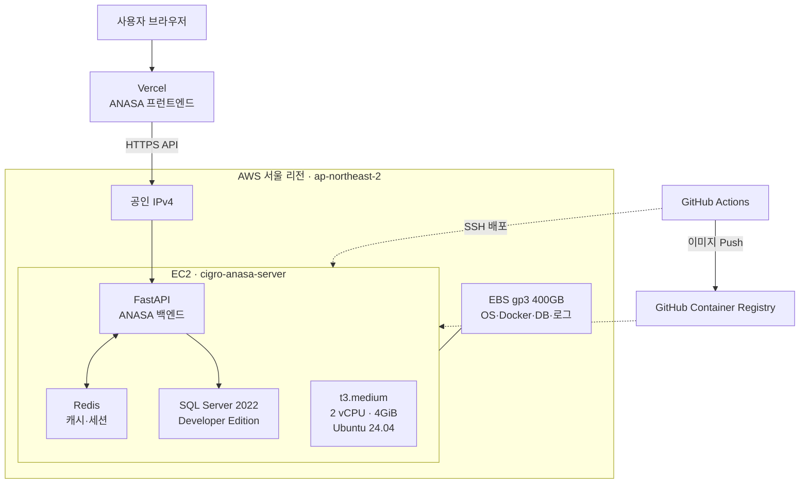

# ANASA 서버·DB·SQL Server 통합 예상 견적

| 항목 | 내용 |
| --- | --- |
| 작성일 | 2026-08-28 |
| 기준 리전 | AWS 서울 `ap-northeast-2` |
| 환율 | USD 1달러 = 1,400원 |
| 원화 표기 | VAT 10% 포함 |
| 견적 기준 | 온디맨드 인프라, SQL Server 2022 Standard 4코어 |

## 1. 요약

현재 ANASA 스테이징은 단일 EC2에서 애플리케이션, Redis, SQL Server Developer Edition을 함께 운영한다. 실제 운영 전에는 Developer Edition을 사용할 수 없으므로 SQL Server Standard Edition으로 전환한다.

현재 DB는 총 약 278.72GB이며, 향후 3배 증가한 약 836GB를 기본 예산 기준으로 삼았다. 운영 안정성을 위해 앱 서버와 DB 서버를 분리하고 DB 저장공간은 1.1TB로 산정했다.

3배 성장 기준 통합 예상 비용은 다음과 같다.

- Standard 연간 구독: VAT 포함 월 약 **688달러 / 96만원**, 연 약 **8,261달러 / 1,156만원**
- Standard 영구 구매: VAT 포함 첫해 약 **13,820달러 / 1,935만원**, 2년 차부터 연 약 **5,141달러 / 720만원**

## 2. 현재 인프라 구조



현재 구조는 앱과 DB가 단일 서버에 함께 있어 운영 부하와 장애가 한 서버에 집중된다. 아래 견적은 운영 환경에서 앱 서버와 DB 서버를 분리하는 것을 전제로 한다.

## 3. 현재 DB 용량

| DB | 데이터 | 로그 | 합계 |
| --- | ---: | ---: | ---: |
| MISTO | 136.33GB | 0.49GB | 136.82GB |
| MISPD | 107.43GB | 8.61GB | 116.04GB |
| MISTW | 13.13GB | 1.70GB | 14.83GB |
| MISSA | 3.29GB | 4.42GB | 7.71GB |
| MISCM | 3.23GB | 0.09GB | 3.32GB |
| **합계** | **263.41GB** | **15.31GB** | **278.72GB** |

`BIZCLIENT`는 조회 계정의 접근 권한이 없어 용량과 기능 검사 범위에서 제외되었다.

## 4. SQL Server Standard 선정 근거

- Developer Edition은 개발·테스트 전용이므로 실제 운영에 사용할 수 없다.
- Express Edition은 DB당 데이터 10GB 제한이 있어 MISTO, MISPD, MISTW를 수용할 수 없다.
- 접근 가능한 5개 DB의 `sys.dm_db_persisted_sku_features` 검사 결과는 0건이다.
- HADR 및 클러스터 구성이 확인되지 않았다.
- Standard Edition은 현재 DB 용량과 3~5배 성장 시나리오를 수용할 수 있다.
- Standard의 최대 24코어 및 128GB 버퍼 풀 한도는 견적 기준인 4 vCPU·32GB보다 충분히 높다.
- 현재 확인 범위에서는 Enterprise Edition의 추가 비용을 정당화할 전용 기능 요구가 없다.

`BIZCLIENT`가 운영 범위에 포함된다면 접근 권한 확보 후 같은 기능 검사를 수행해야 최종 확정할 수 있다.

## 5. SQL Server 2022 에디션 비교 요약

| 에디션 | 운영 사용 | DB 엔진 한도 | 버퍼 풀 | 최대 DB 크기 | ANASA 판단 |
| --- | :---: | ---: | ---: | ---: | --- |
| Enterprise | 가능 | 운영체제 최대 | 운영체제 최대 | 524PB | 전용 기능이 필요할 때만 검토 |
| Standard | 가능 | 4소켓 또는 24코어 | 128GB | 524PB | **현재 권장안** |
| Web | 제한적 | 4소켓 또는 16코어 | 64GB | 524PB | 웹 호스팅 사업자용으로 부적합 |
| Developer | 불가 | Enterprise와 동일 | Enterprise와 동일 | 524PB | 스테이징 전용 |
| Evaluation | 불가 | Enterprise와 동일 | Enterprise와 동일 | 524PB | 180일 평가용 |
| Express | 가능 | 1소켓 또는 4코어 | 1,410MB | DB당 10GB | 현재 DB 용량으로 사용 불가 |

에디션별 용도, 성능·용량 한도, 고가용성 기능 및 가격은 별도 문서에서 확인한다.

- [SQL Server 2022 전체 에디션 비교](./sql-server-2022-edition-comparison.md)
- [Microsoft 공식 SQL Server 2022 기능 비교](https://learn.microsoft.com/en-us/sql/sql-server/editions-and-components-of-sql-server-2022?view=sql-server-ver16)
- [Microsoft 공식 SQL Server 2022 가격](https://www.microsoft.com/en-us/sql-server/sql-server-2022-pricing)

## 6. 운영 견적 구성

| 구분 | 견적 사양 |
| --- | --- |
| 앱 서버 | EC2 `t3.medium` |
| 앱 저장공간 | gp3 50GB |
| DB 서버 | EC2 `r7i.xlarge`, 4 vCPU·32GiB |
| DB 저장공간 | 데이터 증가 시나리오별 gp3 EBS |
| DBMS | SQL Server 2022 Standard 4코어 |
| 네트워크 | 공인 IPv4 1개 및 현재 수준의 외부 전송량 |

DB 저장공간은 다음 방식으로 계산했다.

```text
권장 저장공간 = 예상 DB 용량 × 1.25 + 시스템 공간 약 50GB
```

25%는 데이터 증가, 트랜잭션 로그, 임시 작업을 위한 여유이며 결과는 실제 구성 단위로 올림했다.

## 7. EBS DB 저장공간 가격

서울 리전 gp3 저장공간에는 ANASA 계정의 2026-08 Cost Explorer 실측 단가인 **$0.0912/GB-월**을 적용했다. gp3는 3,000 IOPS와 125MB/s 처리량을 기본 포함하며 초과 설정, 스냅샷과 장기 백업은 별도 과금이다.

| EBS 용량 | 월 세전 | 월 VAT 포함 | 월 원화(VAT 포함) | 적용 시나리오 |
| ---: | ---: | ---: | ---: | --- |
| 400GB | $36.48 | $40.13 | 약 5.6만원 | 현재 볼륨 |
| 500GB | $45.60 | $50.16 | 약 7.0만원 | 현재 DB 권장 |
| 750GB | $68.40 | $75.24 | 약 10.5만원 | DB 2배 |
| 1.1TB | $100.32 | $110.35 | 약 15.4만원 | DB 3배 |
| 1.8TB | $164.16 | $180.58 | 약 25.3만원 | DB 5배 |

- [EBS gp3 가격 산정 상세](./aws-ebs-gp3-pricing.md)
- [AWS 공식 EBS 가격](https://aws.amazon.com/ebs/pricing/)
- [AWS 공식 gp3 성능·기본 제공량](https://docs.aws.amazon.com/ebs/latest/userguide/general-purpose.html#gp3-ebs-volume-type)

## 8. 안 1 — Standard 연간 구독

SQL Server Standard 4코어 구독료는 공개 정가 기준 연 2,836달러다. 월 비용은 연간 구독료를 12개월로 환산한 값이며 실제 결제 조건은 판매 계약에 따른다.

### DB 증가 시 통합 예상 비용

| DB 증가 | 예상 DB | 권장 디스크 | 월 비용(VAT 포함) | 연 비용(VAT 포함) |
| --- | ---: | ---: | ---: | ---: |
| 현재 | 279GB | 500GB | **$628 / 약 88만원** | **$7,538 / 약 1,055만원** |
| 2배 | 557GB | 750GB | **$653 / 약 91만원** | **$7,839 / 약 1,098만원** |
| 3배 | 836GB | 1.1TB | **$688 / 약 96만원** | **$8,261 / 약 1,156만원** |
| 5배 | 1.39TB | 1.8TB | **$759 / 약 106만원** | **$9,103 / 약 1,275만원** |

## 9. 안 2 — Standard 영구 라이선스

SQL Server Standard 4코어 영구 라이선스 공개 정가는 7,890달러다. 첫해에 라이선스를 일시 구매하고, 이후에는 동일 버전을 계속 사용하며 추가 유지계약이 없다는 가정이다.

### DB 증가 시 통합 예상 비용

| DB 증가 | 예상 DB | 권장 디스크 | 첫해 비용(VAT 포함) | 2년 차 이후 연 비용(VAT 포함) |
| --- | ---: | ---: | ---: | ---: |
| 현재 | 279GB | 500GB | **$13,098 / 약 1,834만원** | **$4,419 / 약 619만원** |
| 2배 | 557GB | 750GB | **$13,399 / 약 1,876만원** | **$4,720 / 약 661만원** |
| 3배 | 836GB | 1.1TB | **$13,820 / 약 1,935만원** | **$5,141 / 약 720만원** |
| 5배 | 1.39TB | 1.8TB | **$14,663 / 약 2,053만원** | **$5,984 / 약 838만원** |

## 10. 3배 성장 기준 비교

| 구분 | 연간 구독 | 영구 구매 |
| --- | ---: | ---: |
| 첫해 | **$8,261 / 약 1,156만원** | **$13,820 / 약 1,935만원** |
| 2년 차 | **$8,261 / 약 1,156만원** | **$5,141 / 약 720만원** |
| 3년 누적 | **$24,782 / 약 3,469만원** | **$24,102 / 약 3,374만원** |

단순 공개 정가 기준으로 약 3년 이상 동일 버전을 운영하면 영구 구매가 유리해질 가능성이 있다. 영구 라이선스의 AWS EC2 적용에는 Software Assurance 및 License Mobility 조건 확인이 필요하므로 Microsoft CSP의 최종 검토를 받아야 한다.

## 11. 계산 논리

- 앱 서버, DB 서버 및 SQL Server 라이선스는 사양을 유지하는 동안 고정비다.
- DB 데이터 증가에 따라 직접 증가하는 비용은 주로 EBS 저장공간이다.
- SQL Server 코어 라이선스는 DB 용량이 아니라 할당된 CPU 코어 수를 기준으로 한다.
- 데이터가 증가해도 4 vCPU·32GB를 유지하면 라이선스 비용은 동일하다.
- CPU·메모리 부족으로 DB 서버를 증설하면 EC2와 SQL Server 코어 라이선스 비용이 함께 증가할 수 있다.

## 12. 결론

초기비용과 운영 유연성을 중시하면 Standard 연간 구독이 적합하다. 장기 운영 기간이 3년 이상으로 확정되고 라이선스 이동 조건을 충족할 수 있다면 영구 구매를 검토할 수 있다.

고객사 예산은 DB 3배 성장을 기준으로 다음과 같이 제시한다.

> 연간 구독은 VAT 포함 월 약 96만원, 연 약 1,156만원이다. 영구 구매는 첫해 약 1,935만원이며 2년 차부터 연 약 720만원의 인프라 비용이 예상된다.

## 13. 제외 및 확인 필요 사항

- Vercel 유료 요금
- 별도 오프사이트 백업 및 장기 보관
- 이중화 서버 및 재해 복구 환경
- 운영·유지보수 인력 비용
- 환율 변동 및 Microsoft CSP 할인·계약 조건
- Software Assurance 및 License Mobility 비용·적용 요건
- `BIZCLIENT` 용량과 Enterprise 전용 기능 사용 여부

## 14. 참고

- [Microsoft SQL Server 2022 가격 및 라이선스](https://www.microsoft.com/en-us/sql-server/sql-server-2022-pricing)
- [Microsoft SQL Server 2022 에디션 및 지원 기능](https://learn.microsoft.com/en-us/sql/sql-server/editions-and-components-of-sql-server-2022?view=sql-server-ver16)
- [AWS EBS 가격](https://aws.amazon.com/ebs/pricing/)
- AWS Cost Explorer 계정 조회 기준일: 2026-08-27
- AWS 공개 서울 리전 EC2 가격표 확인일: 2026-08-28
