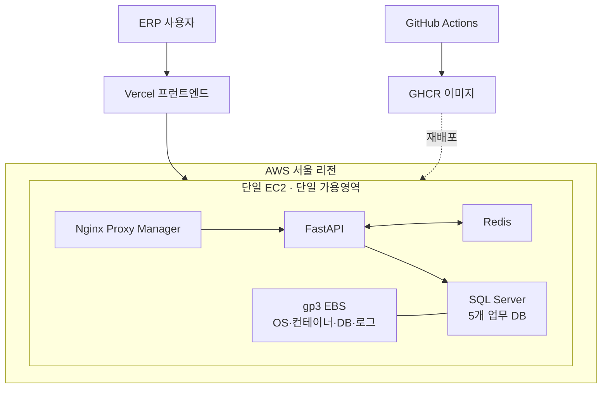

# ANASA 단일 서버 가용성 위험 및 클라우드 전환 권고안

| 항목 | 내용 |
| --- | --- |
| 작성일 | 2026-08-28 |
| 대상 | 다성테크 ANASA 물류 ERP의 온프레미스 → AWS 전환 |
| 점검 근거 | `be_anasa` 배포 구성과 `dasungtech-docs` 기존 인프라 견적 |
| 점검 범위 | 서버·DB·Redis·배포·백업·복구·모니터링 구조 |
| 제외 | AWS 계정의 실시간 설정, 계약 SLA, 실제 업무 중단 손실액 |

## 1. 결론

현재 우려는 타당하다. **기능 추가나 배포가 드물더라도 단일 서버 장애 위험은 줄어들지 않는다.** 기능 변경 외에도 클라우드 호스트 장애, 운영체제·Docker 장애, 디스크 고갈, DB 손상, 인증서·DNS 오류, 보안 사고와 작업자 실수로 ERP가 멈출 수 있기 때문이다.

점검된 구성은 프런트엔드가 Vercel에 분리돼 있지만 FastAPI, SQL Server, Redis와 리버스 프록시가 한 EC2에 집중된 스테이징 구조다. 이 EC2 또는 연결된 EBS를 사용할 수 없으면 로그인, 조회, 주문, 입출고, 재고와 정산 등 핵심 업무가 함께 중단될 수 있다. 프런트 화면이 열리더라도 API와 DB가 없으면 ERP 업무를 지속할 수 없다.

다만 단일 서버라는 이유만으로 즉시 가장 비싼 이중화가 필요한 것은 아니다. 먼저 회사가 허용할 수 있는 중단시간과 데이터 손실량을 정하고 다음 두 단계를 구분해야 한다.

1. **복구 가능한 단일 서버:** 검증된 백업, 모니터링, 자동 복구와 재구축 절차로 수 시간 안에 살릴 수 있는 구조
2. **고가용성 구조:** 두 가용영역에 실행 경로를 두어 수 분~수십 분 안에 전환할 수 있는 구조

권장 순서는 운영 전 복구 가능성을 먼저 증명하고, 출고·입고 중단 손실이 수 시간 복구를 허용하지 않을 때 다중 가용영역 이중화로 확장하는 것이다.

### 클라우드로 옮기는 것 자체가 더 위험한가

그렇지는 않다. 단일 EC2도 단일 장애점이지만, AWS에서는 서버 재생성, EBS 스냅샷, 별도 가용영역 복구, 모니터링과 자동화 같은 수단을 온프레미스보다 빠르게 구성할 수 있다. 제대로 사용하면 전산실 서버 한 대보다 복구력은 좋아진다.

반대로 기존 서버를 EC2 한 대로 그대로 옮기고 백업·알람·복원 훈련을 하지 않으면 물리 서버의 위치만 바뀐 것이다. 회사 인터넷 회선 장애 영향은 줄 수 있지만 클라우드 접속 회선 의존은 커지고, EC2·EBS·AWS 계정 설정이 새로운 운영 위험이 된다.

| 구분 | 회사 전산실 단일 서버 | AWS 단일 EC2 |
| --- | --- | --- |
| 전원·물리 장비 | 회사 UPS·부품·현장 대응에 의존 | AWS 시설과 호스트 복구 수단 활용 |
| 장비 교체 | 부품 조달과 현장 작업 필요 | 새 인스턴스 생성 가능 |
| 데이터 사본 | 별도 장비·장소를 직접 준비 | 스냅샷·S3·교차 리전/계정 선택 가능 |
| 인터넷 | 사내 사용은 내부망으로 지속 가능할 수 있음 | 사용자와 AWS 사이 회선이 필수 |
| 단일 장애점 | 서버·스토리지·전산실 | EC2·EBS·가용영역·계정 구성 |
| 실제 안전성 | 백업·복원 체계에 좌우 | 백업·복원·다중 AZ 사용 수준에 좌우 |

따라서 판단은 “온프레미스인가 클라우드인가”가 아니라 **장애 시 다른 실행 경로와 검증된 데이터 사본이 있는가**를 기준으로 해야 한다.

## 2. 확인된 현재 상태

### 2.1 확인된 사실

| 영역 | 확인 내용 | 의미 |
| --- | --- | --- |
| 프런트엔드 | Vercel에 배포 | EC2와 실행 위치는 분리돼 있으나 API 장애 시 업무 지속 불가 |
| 백엔드 | AWS 서울 리전의 EC2 한 대에서 FastAPI 컨테이너 운영 | 애플리케이션 실행 경로가 하나임 |
| 데이터베이스 | 같은 EC2에서 SQL Server 2022 Developer Edition 컨테이너 운영 | EC2 장애가 DB 장애로 바로 확대됨. 운영 전 정식 라이선스 필요 |
| 캐시·세션 | 같은 EC2의 Redis 사용 | EC2 장애 시 캐시와 세션도 함께 손실 또는 중단 |
| 진입점 | 같은 호스트의 Nginx Proxy Manager를 통한 정황 | 호스트 장애 시 API 진입점도 함께 중단 |
| 저장장치 | 기존 견적 기준 gp3 EBS 400GB에 OS·Docker·DB·로그 집중 | 용량 고갈과 볼륨 장애의 영향 범위가 큼 |
| 배포 | GitHub Actions → GHCR → EC2 SSH 배포 | 애플리케이션 이미지는 재생성 가능 |
| 프로세스 복구 | Docker 재시작 정책, API 헬스체크, SQL Server 수동 복구 워크플로 존재 | 컨테이너 단위 장애에는 일부 대응 가능 |
| 배포 복구 | 배포 중 헬스체크와 롤백 처리 존재 | 잘못된 앱 배포 위험 일부 완화 |
| 데이터 규모 | 접근 가능한 5개 DB 합계 약 278.72GB | 백업·복원 시간을 실측해야 할 규모 |
| 현재 환경 | 점검된 자동 배포 워크플로는 스테이징 전용이며 운영 배포를 차단 | 운영 인프라 설계는 아직 별도 확정이 필요함 |

현재 구조는 다음과 같이 요약된다.

### 2.2 확인되지 않은 항목

저장소에 설정이 없다는 사실만으로 AWS에 기능이 없다고 단정할 수는 없다. 다음 항목은 AWS 계정 실사와 운영자 확인이 필요하다.

- AWS Backup 또는 DLM의 EBS 스냅샷 주기·보존기간·암호화·교차 리전/교차 계정 복제
- SQL Server 전체·차등·트랜잭션 로그 백업 주기와 별도 저장소 보관
- 실제 복원 성공일, 복원 소요시간과 데이터 정합성 검증 결과
- EC2 상태 검사 자동 복구, CloudWatch Agent, 디스크·메모리·DB 알람과 SNS 호출 대상
- Elastic IP, Route 53 또는 Cloudflare DNS 전환 절차
- EBS 암호화, 보안그룹의 1433/6379 비공개 여부, SSH 접근 제한
- EC2 IAM Role과 백업 저장소의 최소 권한·삭제 방지
- 온프레미스 서버를 전환 후 얼마 동안 어떤 상태로 보존할지
- 운영시간, 피크 출고시간, 수기 대체 가능 시간과 시간당 중단 손실

AWS CLI 자격증명이 현재 점검 환경에 없어 이 항목의 실시간 상태는 검증하지 못했다.

## 3. 왜 기능 변경이 적어도 위험한가

애플리케이션 변경 빈도는 배포 실패 확률에는 영향을 주지만 전체 장애 원인의 일부일 뿐이다.

| 장애 원인 | 기능 변경과의 관계 | 단일 서버에서의 결과 |
| --- | --- | --- |
| EC2 물리 호스트·인스턴스 상태 이상 | 무관 | API·DB·Redis·프록시 동시 중단 |
| EBS 연결 불가·파일시스템 또는 DB 손상 | 무관 | 데이터 접근 불가, 복원 전까지 업무 중단 |
| 가용영역 장애 | 무관 | 같은 AZ의 EC2와 EBS를 동시에 사용할 수 없음 |
| 디스크 고갈·메모리 부족·CPU 포화 | 운영량에 좌우 | DB와 API가 서로 자원을 밀어내며 연쇄 장애 가능 |
| OS·Docker·보안 패치 재부팅 | 정기 운영 작업 | 대체 서버가 없으면 계획 중단 발생 |
| 인증서·DNS·방화벽·계정 오류 | 무관 | 서버가 살아 있어도 사용자는 접속 불가 |
| 랜섬웨어·자격증명 탈취·작업자 실수 | 무관 | 같은 계정/서버의 원본과 백업이 함께 훼손될 수 있음 |

즉, “변경이 적다”는 이유는 안정적인 운영 절차에 유리하지만 단일 장애점을 제거하지는 않는다.

## 4. 현재 위험 평가

평가는 AWS 실사 전의 초기값이다. `가능성`과 `영향`은 낮음/중간/높음/치명으로 표시한다.

| 위험 | 가능성 | 영향 | 현재 평가 | 판단 |
| --- | :---: | :---: | :---: | --- |
| EC2 또는 호스트 장애 | 중간 | 치명 | **높음** | 핵심 구성요소가 한 인스턴스에 집중 |
| EBS·DB 손상 또는 삭제 | 낮음~중간 | 치명 | **높음** | 별도 복원 시험 증거 미확인 |
| 가용영역 장애 | 낮음 | 치명 | **높음** | 다른 AZ 실행·데이터 경로 미확인 |
| 자원 포화·디스크 고갈 | 중간 | 높음 | **높음** | 앱과 약 279GB DB가 소형 서버 자원 공유 |
| 컨테이너 프로세스 장애 | 중간 | 중간 | **중간** | 재시작 정책과 수동 복구 워크플로 존재 |
| 애플리케이션 배포 실패 | 낮음~중간 | 높음 | **중간** | 헬스체크·롤백은 있으나 서버 대체 경로는 없음 |
| 백업은 있으나 복원 실패 | 미확인 | 치명 | **높음** | 백업 존재보다 복원 검증이 중요 |
| 보안 사고·운영자 실수 | 낮음~중간 | 치명 | **높음** | 격리·삭제 방지 백업 여부 미확인 |

### 핵심 해석

- 현재 구조는 “서버가 자주 고장날 가능성”보다 **한 번 고장났을 때 전 업무가 같이 멈추는 영향**이 문제다.
- Docker 재시작은 애플리케이션 프로세스를 다시 띄울 뿐 EC2, EBS, AZ 장애를 해결하지 않는다.
- 앱 서버와 DB 서버를 분리하면 자원 경합과 장애 범위는 줄지만, 각 서버가 한 대뿐이면 여전히 고가용성은 아니다.
- GHCR의 앱 이미지는 다시 받을 수 있지만 DB 원본은 이미지에서 복원할 수 없다. 데이터 백업이 최우선이다.

## 5. 먼저 정해야 할 복구 목표

### 5.1 용어

- **RTO(복구시간목표):** 장애 발생 후 업무를 다시 시작할 때까지 허용하는 최대 시간
- **RPO(복구시점목표):** 복구 시 잃어도 되는 최근 데이터의 최대 시간 범위

### 5.2 의사결정용 초안

아래 수치는 설계 선택을 위한 초안이며 회사 승인이 필요하다.

| 업무 수준 | RTO 초안 | RPO 초안 | 적합한 구조 |
| --- | ---: | ---: | --- |
| 반나절 중단과 일부 재입력 허용 | 4~8시간 | 1~4시간 | 복구 가능한 단일 서버 + 검증된 백업 |
| 출고시간 중 수 시간 중단 곤란 | 1~4시간 | 15~60분 | 앱/DB 분리 + 다른 AZ 파일럿 라이트 또는 웜 스탠바이 |
| 수 분 이상 중단이 큰 손실 | 15~60분 | 0~15분 | 다중 AZ 앱 + DB 복제/자동 전환 |
| 사실상 연속 운영 필요 | 15분 미만 | 수 초~수 분 | 완전한 HA 설계, 자동 장애조치와 정기 훈련 |

RTO/RPO는 백업 설정값으로 약속하면 안 된다. 약 279GB 데이터를 실제로 새 환경에 복원하고 업무 검증까지 끝낸 시간을 기준으로 확정해야 한다.

## 6. 선택지 비교

| 안 | 구성 | 기대 효과 | 한계 | 적합 조건 |
| --- | --- | --- | --- | --- |
| A. 단일 서버 보호 강화 | 현재 EC2 유지, SQL 네이티브 백업, EBS 스냅샷, 모니터링, 자동 복구, 재구축 스크립트 | 가장 낮은 추가 비용, 데이터 복구 가능성 확보 | 장애 중 업무 중단, AZ 장애 시 수동 복원 | 4~8시간 중단 허용 |
| B. 분리 + 파일럿 라이트 | 앱/DB 서버 분리, 다른 AZ에 재구축 가능한 네트워크·이미지·백업, 필요 시 정지/소형 대기 서버 | 장애 범위 축소, 수 시간 내 다른 AZ 복구 | 완전 자동 전환 아님, 복구 훈련 필수 | 1~4시간 중단 허용 |
| C. 웜 스탠바이 | 두 AZ 앱 경로, 대기 DB에 주기적 로그 전달, Redis 외부화 | 더 짧은 RTO/RPO, 전환 예측 가능 | 이중 인프라·SQL 라이선스·운영 복잡성 증가 | 출고 중 수 시간 중단 불가 |
| D. 다중 AZ 고가용성 | ALB + 두 앱 인스턴스, 관리형 Redis 복제, SQL Server Multi-AZ/Always On 계열 | 인스턴스·AZ 장애 자동 또는 신속 전환 | 가장 높은 비용과 검증 부담 | 중단 비용이 이중화 비용보다 큼 |

### SQL Server 선택 주의

현재 시스템은 접근 가능한 DB만 5개이고 활성 저장 프로시저가 많다. RDS for SQL Server Multi-AZ 또는 자체 Always On 구성을 선택하기 전에 다음 호환성을 PoC로 검증해야 한다.

- 5개 DB 사이 호출과 트랜잭션의 장애조치 일관성
- SQL Agent, 백업·복원, 로그인과 권한
- T-SQL 및 저장 프로시저 기능
- 장애조치 후 연결 문자열과 세션 재연결
- SQL Server Standard 라이선스의 고가용성 권리와 보조 서버 조건

관리형 DB가 운영 부담을 줄일 수는 있지만 현재 저장 프로시저를 검증 없이 그대로 옮길 수 있다고 가정하면 안 된다.

## 7. 권장 실행안

### 0단계 — 운영 전 필수 게이트

다음 항목을 통과하기 전에는 기존 전산실 서버를 제거하거나 클라우드를 유일한 운영 원본으로 만들지 않는다.

1. 업무별 RTO/RPO를 대표이사·운영 책임자·물류 담당자가 승인한다.
2. 운영은 SQL Server Developer Edition이 아닌 적법한 운영 라이선스로 구성한다.
3. SQL Server 전체·차등·로그 백업 정책과 별도 저장소를 확정한다.
4. EBS/인스턴스 계층 스냅샷과 보존·삭제 방지 정책을 확정한다.
5. 깨끗한 새 인스턴스에서 전체 복원을 수행하고 시간과 검증 결과를 기록한다.
6. 장애 알람이 실제 담당자의 전화·메신저·이메일로 도착하는지 시험한다.
7. 온프레미스 → 클라우드 절체와 롤백 리허설을 완료한다.

### 1단계 — 저비용 위험 감소

- SQL Server가 FULL 복구 모델을 사용할 수 있는지 확인하고 업무 RPO에 맞춰 전체·차등·로그 백업을 구성한다.
- DB 네이티브 백업은 EC2의 같은 EBS에만 두지 않고 암호화된 S3 등 별도 저장소로 복사한다.
- AWS Backup/DLM으로 EBS 스냅샷을 별도 계층에 보관한다. DB 네이티브 백업과 EBS 스냅샷은 서로 대체 관계가 아니다.
- CloudWatch Agent로 메모리, 디스크 사용률, 프로세스와 로그를 수집한다.
- EC2 상태 검사, API 외부 헬스체크, DB 접속, 백업 실패, 디스크 70/85/95% 임계치 알람을 만든다.
- Docker/OS 구성, 볼륨 연결, 환경변수 주입과 컨테이너 기동 절차를 코드 또는 문서로 재현 가능하게 만든다.
- 이미지 태그와 Redis 등 기반 이미지 버전을 고정해 `latest` 변경 위험을 제거한다.
- 복구 책임자, 보조 책임자와 비상 연락망을 지정한다.

### 2단계 — 앱/DB 분리

기존 비용 문서의 권고처럼 앱과 DB를 별도 EC2로 분리한다. 이 단계의 주목적은 다음과 같다.

- API/Redis 부하와 SQL Server 부하의 자원 경합 제거
- 앱 재배포·재시작이 DB에 미치는 영향 축소
- DB 저장공간과 보안 경계를 별도 관리
- 앱 서버를 더 쉽게 교체·증설할 수 있게 함

단, **분리만으로 이중화가 완성되지는 않는다.** 앱 한 대와 DB 한 대라면 각 계층에 단일 장애점이 남는다.

### 3단계 — RTO/RPO에 따라 고가용성 선택

- 승인된 RTO가 4시간 이상이면 A 또는 B안을 우선하고 분기별 복구 훈련으로 보완한다.
- 승인된 RTO가 1시간 이하면 두 AZ 앱 경로와 대기 DB를 포함한 C 또는 D안을 검토한다.
- 실제 출고 피크 중단 손실액과 연간 이중화 비용을 비교해 최종 승인한다.
- DB 이중화는 대표 5개 DB와 핵심 저장 프로시저로 장애조치 PoC를 통과한 뒤 도입한다.

### 현재 권장안

현 시점의 균형안은 다음과 같다.

> **운영 전에는 0~1단계를 필수로 완료하고, 앱/DB 분리를 기본 구조로 채택한다. 임시 RTO 4시간·RPO 15분을 목표로 실제 복원 시간을 측정한다. 측정 결과 또는 물류 중단 손실이 목표를 만족하지 못하면 두 AZ 웜 스탠바이로 확장한다.**

RTO 4시간과 RPO 15분은 확정 약속이 아니라 복원 훈련과 경영 승인 전의 설계 기준이다.

## 8. 온프레미스 → 클라우드 전환 주의사항

기존 전산실 서버는 전환 직후 바로 폐기하지 않는다. 다만 두 서버를 동시에 쓰기 가능한 상태로 두면 데이터가 갈라질 수 있으므로 반드시 하나만 쓰기 원본으로 지정한다.

### 전환 전

1. 전체 DB 백업과 CHECKSUM을 생성한다.
2. 클라우드에 복원하고 DB별 행 수, 기준 합계, 핵심 저장 프로시저와 업무 시나리오를 검증한다.
3. DNS TTL, 사용자 공지, 중단 시간, 최종 증분 데이터 반영 방식과 롤백 승인자를 정한다.
4. 전환 직전 쓰기 중지 시점을 정하고 미처리 주문·출고 건을 기록한다.

### 전환 시

1. 온프레미스를 쓰기 중지 또는 읽기 전용으로 전환한다.
2. 마지막 차등·로그 백업을 클라우드에 적용한다.
3. 데이터 기준 시각과 마지막 트랜잭션을 확인한다.
4. API/DNS를 클라우드로 전환한다.
5. 로그인, 주문, 입고, 출고, 재고, 정산과 출력물을 업무 담당자가 확인한다.

### 전환 후

- 정해진 관찰 기간 동안 온프레미스 원본을 읽기 전용·접근 제한 상태로 보존한다.
- 클라우드 전환 후 생성된 데이터를 무시한 채 단순히 온프레미스로 되돌리지 않는다.
- 롤백이 필요하면 클라우드의 전환 후 데이터 반영 또는 업무 재입력 계획을 먼저 승인한다.
- 관찰 기간이 끝나고 백업·복원 증거가 확보된 뒤 온프레미스 폐기 일정을 확정한다.

## 9. 승인해야 할 결정

| 결정 | 선택지 | 승인자 | 상태 |
| --- | --- | --- | --- |
| 업무시간 RTO | 8시간 / 4시간 / 1시간 / 15분 | 경영·물류 | 미정 |
| 주문·재고 RPO | 4시간 / 1시간 / 15분 / 0에 근접 | 경영·물류 | 미정 |
| 목표 구조 | A / B / C / D | 경영·개발·운영 | 미정 |
| DB 운영 방식 | 자체 EC2 / RDS SQL Server PoC / 기타 | 개발·DBA | 미정 |
| 온프레미스 보존기간 | 2주 / 1개월 / 3개월 | 경영·보안 | 미정 |
| 백업 보존 | 일·주·월 보존기간 및 교차 계정/리전 | 운영·보안 | 미정 |
| 장애 호출 | 주·야간 1차/2차 담당자와 연락 수단 | 운영 | 미정 |

## 10. 비용 문서와의 관계

기존 [ANASA 서버·DB·SQL Server 통합 예상 견적](../견적서/ANASA-서버-DB-SQL-Server-통합-예상-견적.md)은 앱/DB 분리를 기준으로 하지만 다음 비용을 제외한다고 명시한다.

- 별도 오프사이트 백업 및 장기 보관
- 이중화 서버 및 재해복구 환경
- 운영·유지보수 인력

따라서 기존 월 예상비용을 “고가용성까지 포함한 최종 운영비”로 해석하면 안 된다. RTO/RPO와 목표 구조를 정한 뒤 백업·모니터링·대기 서버·DB 라이선스를 추가 산정해야 한다.

## 11. 근거와 참고자료

### 저장소 근거

- `be_anasa/Dockerfile` — FastAPI 단일 워커와 현재 스테이징 자원 제약 설명
- `be_anasa/docker-compose.yml` — API·Redis 재시작 정책과 헬스체크
- `be_anasa/.github/workflows/deploy-staging.yml` — GHCR/SSH 기반 스테이징 배포, 헬스체크와 롤백
- `be_anasa/.github/workflows/recover-staging-sqlserver.yml` — 동일 EC2의 SQL Server 컨테이너 수동 재시작
- `be_anasa/ENVIRONMENT.md` — Candidate·Staging·Production 환경 계약
- [ANASA 서버·DB·SQL Server 통합 예상 견적](../견적서/ANASA-서버-DB-SQL-Server-통합-예상-견적.md) — 현재 사양, DB 크기와 분리 견적

### 공식 참고자료

- [AWS Well-Architected Framework — Reliability Pillar](https://docs.aws.amazon.com/wellarchitected/latest/reliability-pillar/welcome.html)
- [AWS Prescriptive Guidance — High availability and disaster recovery for SQL Server on Amazon EC2](https://docs.aws.amazon.com/prescriptive-guidance/latest/sql-server-ec2-ha-dr/welcome.html)
- [Amazon EBS snapshots](https://docs.aws.amazon.com/ebs/latest/userguide/ebs-snapshots.html)
- [EC2 status checks](https://docs.aws.amazon.com/AWSEC2/latest/UserGuide/monitoring-system-instance-status-check.html)
- [Microsoft — Back up and restore of SQL Server databases](https://learn.microsoft.com/en-us/sql/relational-databases/backup-restore/back-up-and-restore-of-sql-server-databases)
- [Microsoft — Always On availability groups](https://learn.microsoft.com/en-us/sql/database-engine/availability-groups/windows/overview-of-always-on-availability-groups-sql-server)
